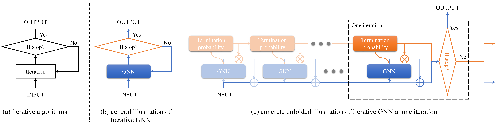

# Iterative Homogeneous GNNs

This repo contains a pytorch implementation of the method introduced in the paper: 

[**Towards Scale-Invariant Graph-related Problem Solving by Iterative Homogeneous Graph Neural Networks**](https://arxiv.org/abs/2010.13547)  
[Hao Tang](https://haotang1995.github.io/), [Zhiao Huang](https://sites.google.com/view/zhiao-huang),[Jiayuan Gu](http://cseweb.ucsd.edu/~jigu/), [Bao-Liang Lu](http://bcmi.sjtu.edu.cn/~blu/), [Hao Su](http://cseweb.ucsd.edu/~haosu)  
NeurIPS 2020

Please see our [paper](https://arxiv.org/abs/2010.13547) and the [short intro video](https://youtu.be/--r3HIGco6Q) for more details.



## Usage

### Environment 

We provide a docker image: [haotang95/itergnn:main](https://hub.docker.com/r/haotang95/itergnn) , and a [requirements.txt](requirements.txt) for conda.   
The docker image is built upon [pytorch/1.1.0-cuda10.0-cudnn7.5-devel](https://hub.docker.com/layers/pytorch/pytorch/1.1.0-cuda10.0-cudnn7.5-devel/images/sha256-1be771bff6d18ede7d98c171c577ae8fcbaf6f53b59a3e5fe5cee9e36e188fbc?context=explore) . Please follow the guidance and tutorials of Pytorch for the usage of dockers.

The concrete environments are listed as follows:

* Torch-geometric 1.3.2
* Torch-scatter 1.4.0
* Pytorch 1.1.0
* CUDA 10.0
* CuDNN 7.5.1

### Train & Test

To train the model, we run 

```
python train.py <training-dataset-param> <model-param>
```

To test the model on graphs with larger node numbers, we run

```
python test.py <training-dataset-param> <model-param> <testing-dataset-param> <max-iteration-num>
```

To test the model on graphs with larger edge weights, we run

```
python test_weighted.py <training-dataset-param> <model-param> <training-dataset-param><max-iteration-num>
```

For example, to reproduce the results of IterHomoGNN on the unweighted shortest path problem with Lobster as the generator, we need to run 

```
python train.py lobster-unweighted DecIterGNN30-HomoPathSimConv-Max 
python test.py lobster-unweighted DecIterGNN30-HomoPathSimConv-Max lobster-unweighted-500 10000
```

In detail, the dataset parameters are defined as `<generator>-<weighted-flag>-<size>`, where `<generator>` has four choices: `lobster`,  `knn`, `mesh`, `random`, each corresponding to the Lobster, KNN, Planar, and Erdos-Renyi generators in the paper. The `<weighted-flag>` has two choices: `weighted` and `unweighted`, each corresponding to the weighted graphs and the unweighted graphs. The `<size>` contains only one integer, indicating the graph sizes, i.e., the number of nodes in the graph. 

The model parameters are defined as `<architecture>-<layer>-<readout>-<module-num>`, where 

* `<architecture>` is defined as `<architecture-name><max-iter-num>`, where `<architecture-name>` specifies which GNN architecture to use, while `<max-iter-num>` specifies the maximum of the number of iterations during training. For example, `DecIterGNN30` means that we use IterGNN with the decaying confidence mechanism and the maximum iteration number during training is 30. Other popular choices include `DeepGNN30`, which means stacking 30 GNN layers, and `SharedDeepGNN30` , which means iterating the same GNN layer for 30 times. The concrete definitions are listed in models/gnn_architecture.py .
* `<layer>` is defined as `<homo-flag><layer-name>`, where `<layer-name>` specifies which GNN layer  to use. We support classical GNN layers, such as GCNConv, GATConv, and GINConv, implemented by pytorch-geometric, as well as the three variants of PathGNN, i.e. MPNNMaxConv, PathConv, and PathSimConv. The `<homo-flag>` has three choices, i.e., `Homo`, `SHomo`, and ` ` (empty string), each corresponding to "the whole model uses the homogeneous prior", "only the GNN parts use the homogeneous prior" (i.e. semi-homogeneous), and "Not using the homogeneous prior". The concrete definitions are listed in models/gnn_layers.py .
* `<readout>` defines which readout function to use. We support classical max/min/sum/mean poolings, as well as those attention-based poolings, as defined in models/gnn_aggregation.py .
* `<module-num>` is optional and is an integer. The default is one. It indicates how many GNN-architectures we stack in one model. For example, `DecIterGNN30-MPNNMaxConv-Max-2` means that we stack two DecIterGNN (maximum-iteration-num=30) with MPNNMaxConv as the GNN layer (no homogeneous piror is applied), and the max pooling as the readout function, while building the model. In our experiments, we set `module-num` to two only when solving the component counting problem. 

For the training dataset parameter, the size assignment is ignored. We always train models on graphs with $[4,34)$ nodes. During testing, the  `<max-iteration-num>` argument rewrites the maximum-iteration-number defined in the `<model-parameter>`. We usually set it to an extremely large number for IterGNNs and set it to be the same as graph sizes for SharedDeepGNNs. 

### Analyze & Evaluation

Note that we generate new datasets for each run of the codes. So, there is no need to split datasets into training/validation/test datasets. Instead, we use `test.py` and `best_parameters.py` to tune the hyper-parameters. We can run 

```
python best_parameters.py <testing-dataset-param>
```

to compare the performance of different models. And then, to report the performance of the specific best model (i.e., which achieves the best performance), we can run 

```
python test_model.py <training-dataset-param> <model-param> <testing-dataset-param> <max-iteration-num> <model-path>
```

, where `<model-path>` points to the `.pth` file which stores the parameters of the best model.

## Citations

If you find our work useful in your research, please consider citing:

```latex
@article{tang2020towards,
  title={Towards Scale-Invariant Graph-related Problem Solving by Iterative Homogeneous GNNs},
  author={Tang, Hao and Huang, Zhiao and Gu, Jiayuan and Lu, Baoliang and Su, Hao},
  journal={the 34th Annual Conference on Neural Information Processing Systems (NeurIPS)},
  year={2020}
}  
```

